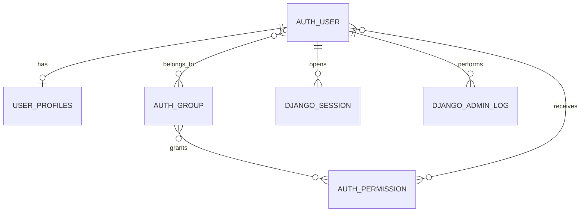

# Domain 2 ERD (MDN-aligned)

```mermaid
erDiagram
    AUTH_USER ||--o| USER_PROFILES : has
    AUTH_USER }o--o{ AUTH_GROUP : belongs_to
    AUTH_GROUP }o--o{ AUTH_PERMISSION : grants
    AUTH_USER }o--o{ AUTH_PERMISSION : receives
    AUTH_USER ||--o{ DJANGO_SESSION : opens
    AUTH_USER ||--o{ DJANGO_ADMIN_LOG : performs
```

`AUTH_USER`, groups, permissions, sessions, and admin logs are supplied by Django. `USER_PROFILES` is the only project-specific Domain 2 table.
